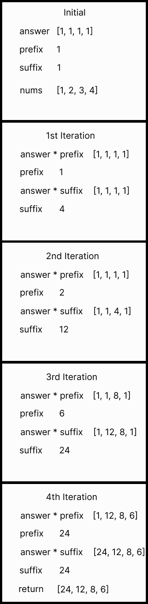

# 💡 Explanation for [238](https://leetcode.com/problems/product-of-array-except-self/)
## ❗This is not the most efficient way to solve this, this is just my solution❗
### Initially I had written this in a O(n) runtime using the division operator, however the challenge for this problem was to not use division to figure out the answer.
### I was not able to actually solve it without a division operator and instead looked into other peoples solutions and found out they were doing some really impressive swapping between variables, specifically an array (answer) that holds a base value of 1 for each element in a list of the same size as the given array (nums).
### Now we also set 2 other variables to 1 (suffix and prefix). Prefix will be used to calculate everything to the left side of the index pointed to during the for loop, the suffix will be used to calculate everything to the right of the index during the for loop.
```python
for i in range(len(nums)):
  answer[i] *= prefix
  prefix *= nums[i]
  answer[-1 - i] *= suffix
  suffix *= nums[-1 - i]
```
### We go through and multiply each part of this as needed and we eventually get answer to be returned correctly
## Visual Explanation of swap and inputting of the data 
